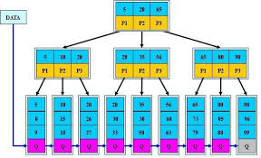

# map与外存数据检索

对于无法全部放入内存的大数据的管理和操作。

考虑存储机制， 外存数据时按 磁盘块  为单位 调入内存。
内存与外存数据的交互是一个很耗时的操作， 从而数据结构的优劣的评价标准就是 内外存调换的次数， 即io时间复杂度。

## 一些实现方式

### 无序双向链表
在内存中, 查询和修改都是O(n), 插入O(1)
如果一个磁盘块可以存放 B个节点，则 查询需要的io次数为 O(n/B)
最差的情况， 每个节点都位于不同的磁盘块中， 没查询一次都要io一次.

### 有序数组
在内存中, 查询可以使用 二分查找, o(logn), 但是仅对于在内存中的数据的查询
删除和插入 需要移动元素, 复杂度为O(n), 最差的情况会修改所有的节点, io次数也为 O(n/B)

### 树形结构
内部节点包含的内容 关键字, 关键字对应的block地址, 和大于和小于关键字内容的节点的索引

#### 平衡树(平衡搜索树， 红黑树)
对于外存数据, 最坏的情况, 如果每个节点都不在同一个磁盘块中, 需要O(logn)次io， 时间复杂度O(logn), 底数为2

#### 多路搜索树 (a, b)树
多路搜索树的改善在于 降低了树 的高度

每个节点的子节点数，范围 [a, b]
所有的叶子节点都在同一层上， 即拥有相同的深度。
a,b关系  2<=a<=(b+1)/2

阶的概念, 即最大孩子节点的数量, b
    在5阶B树中，结点最多有4个key, 最少有2个key

考虑高度为 h 的 叶子节点个数。
```cpp
最小, 每个节点的子节点数都为a,  m = n+1 = a^h  >= 2a^(h-1), a>=2
最大, 每个节点的子节点数都为b,  m = n+1 = b^h

2 * a^(h-1) <= n+1 <= b^h

于是得到
log(n+1) * 1/logb <= h <= ( log((n+1)/2) * 1/loga ) + 1

即
h  O(logn * 1/ loga)
h  Ω(logn * 1/ logb)

也就高度缩小了 logb ~ loga 倍
```

对于多路搜索树的一个节点, 自身也是一个map, 所以最好使得一个 内存块就能存放map 的全部节点

对于插入操作, 找到对应的节点之后， 如果当前节点元素个数为b， 则需要 分裂调整。
当前节点分裂成两半， 移动一个元素给父节点。 再逐级往上调整

对于删除操作， 如果删除后节点元素小于a, 即a-1， 则需要调整。
通过兄弟节点借元素或和兄弟节点合并了调整。

以上调整需要进行多次的 磁盘io, 而次数成比例与 树的高度, 即O(h)

所以 以上操作的时间复杂度
O(logn * 1/ loga)
Ω(logn * 1/ logb)

#### B- Tree
a=ceil(d/2) b=d, d成比例与B, B是磁盘块的大小， 可以灵活的调整。
可以理解为 b树是一棵单节点能够容纳很多元素的多路搜索树, 每个节点的大小就是一个磁盘块的大小, 也就是由一个个磁盘块大小节点组成的树

由于 a, b 都B成比例, 则最后的复杂度为
O(logn / logB)

#### B+ Tree
参考资料 https://zhuanlan.zhihu.com/p/27700617

B plus, 顾名思义, 升级版
内部节点的组成
    (关键字1，大于该关键字,小于关键字2的元素节点索引)(关键字2，大于该关键字2, 小于关键字3的元素的节点索引)....

叶子节点的元素组成
    (关键字1，对应记录的外存地址)(关键字2，对应记录的外存地址)

两种常见的定义方式,
一种定义方式是关键字个数和孩子结点个数相同。
另一种是关键字个数比孩子结点个数小1，这种方式符合多路搜索树的定义

对于b-树， 做了以下调整
1. 内部节点不保存关键字记录的外存地址, 只进行内存中节点的数据索引, 即只有关键字和关键字对应的子节点索引，而真正的外存地址保存在叶子节点上。 这样做有带来两个特点
    每个内部节点能保存更多的关键字
    内部节点的每一个关键字都是某个叶子节点中 最小的关键字
    查询数据不仅要查到内部节点的关键字，要一直往下找到叶子节点, 这样使得每次的查询次数都是相同的

2. 叶子节点的关键字从小到大有序排列, 为有序数组, 并且所有的叶子节点组成一个链表。 这样，使得所有关键字保持了一个有序的状态. 有以下好处
    在叶子节点的查询可以使用 二分查找
    遍历b+树时，就是遍历由叶子节点组成的链表， 而且是有序的， 岂不美哉。

    
